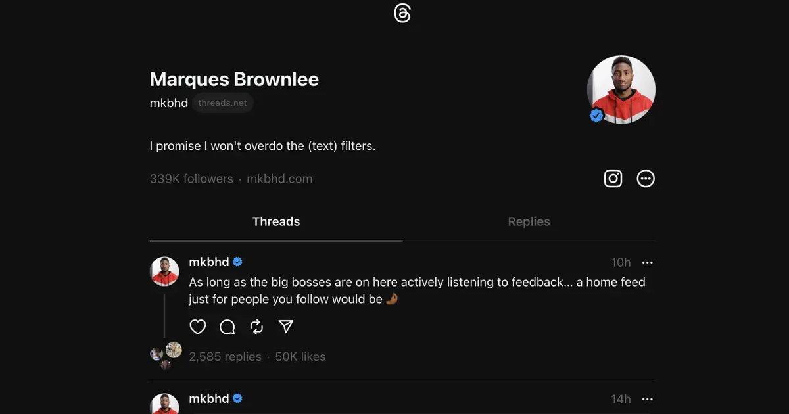

> Social Media MERN Application using React Js
> [Follow or Connect me](https://www.linkedin.com/in/jagan-kumar-hotta-502a76270/)




## Checking Node.js Version:

```
node -v
yarn -v

```

## Creating a React Project (Using npm or yarn):

Using npm:

```
npm create-react-app my-react-app
cd my-react-app

```

## Replace my-react-app with your desired project name.

## Using yarn:

```
yarn create react-app my-react-app
cd my-react-app

```
## Starting the Development Server:

```
npm start   # Using npm
yarn start   # Using yarn

```

## Running the Client (Using yarn):

```
yarn start

```

## Technologies Used

# This project utilizes a powerful combination of libraries and frameworks to create a dynamic and user-friendly experience.

> React.js (https://legacy.reactjs.org/): A powerful JavaScript library for building user interfaces.

> MongoDB(en.wikipedia.org/wiki/MongoDB): Unlike relational databases which store data in tables with rows and columns, MongoDB stores data in flexible, JSON-like documents. This document structure makes MongoDB a good choice for storing data that doesn't fit neatly into a tabular format, such as user profiles, product catalogs, or social media posts.

> Tailwind CSS (https://tailwindcss.com/docs/installation): A utility-first CSS framework for rapidly building modern websites.

> Express.js (https://expressjs.com/): A Node.js framework for building web applications and APIs.

> React Router DOM (https://reacttraining.com/react-router): A routing library for React that simplifies navigation between different views in your application.

> React Icons (https://react-icons.github.io/react-icons/): A collection of SVG icons readily available for use in React projects.

## Install additional dependencies:

```````
npm install firebase tailwindcss express react-router-dom framer-motion react-icons  # Using npm
yarn add firebase tailwindcss express react-router-dom framer-motion react-icons  # Using yarn

```````

## Running the Development Server:

`````
npm start   # Using npm
yarn start   # Using yarn

`````
## This will launch the development server, typically accessible at http://localhost:3000/ in your web browser. You'll see your React app running!

## Contributing

We welcome contributions from the community! To ensure a smooth development process, here are some guidelines to follow:

> > How to Contribute

Fork the repository: Create a fork of this repository on GitHub.

Clone your fork: Clone your forked repository to your local machine.

Create a new branch: Create a new branch for your feature or bug fix.

Make changes: Implement your changes and write clear code comments.

Test your changes: Thoroughly test your changes to ensure they don't introduce any regressions.

Commit your changes: Commit your changes with descriptive commit messages.

Push your changes: Push your changes to your forked branch.

Create a pull request: Create a pull request from your forked branch to the main branch of this repository.
Code Style Preferences

We follow convention: https://link-to-code-style-guide for code style and formatting.
Use consistent indentation (usually 2 spaces).

Write clear and concise variable and function names.

Add comments to explain complex logic.

> > Testing Requirements

All pull requests must include unit tests or integration tests to ensure their functionality.
We use testing framework name: https://link-to-testing-framework for our tests.
Ensure your tests cover different scenarios and edge cases.
